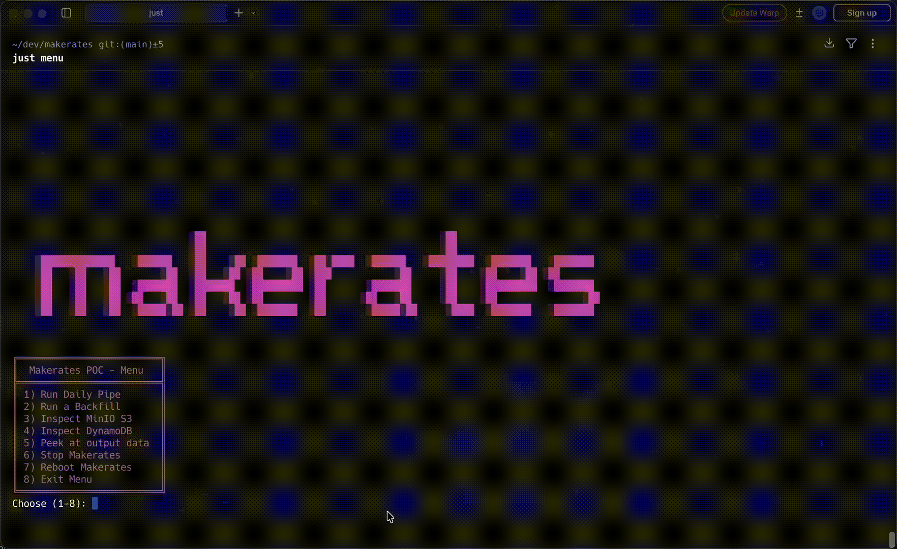
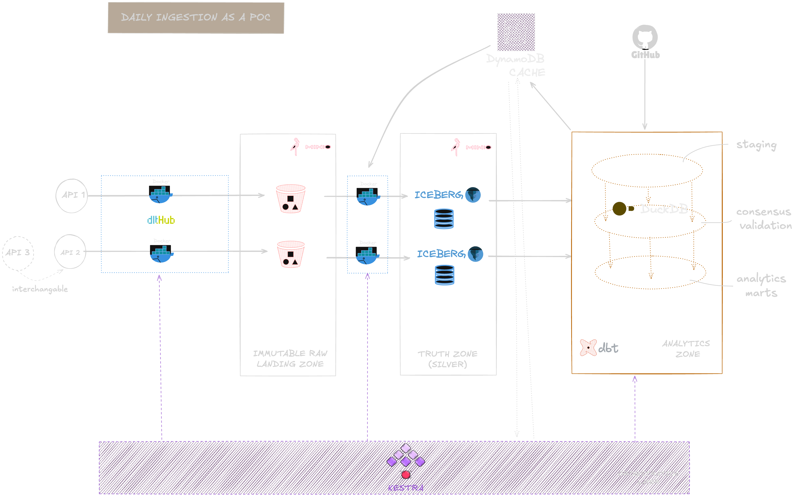
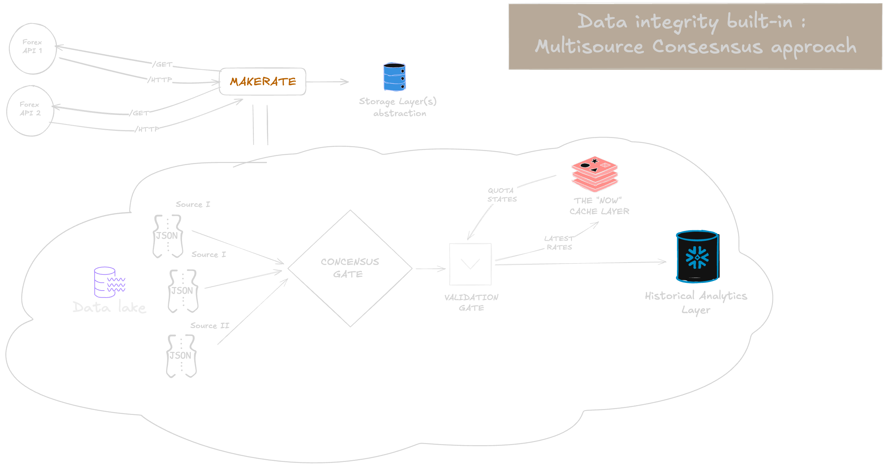
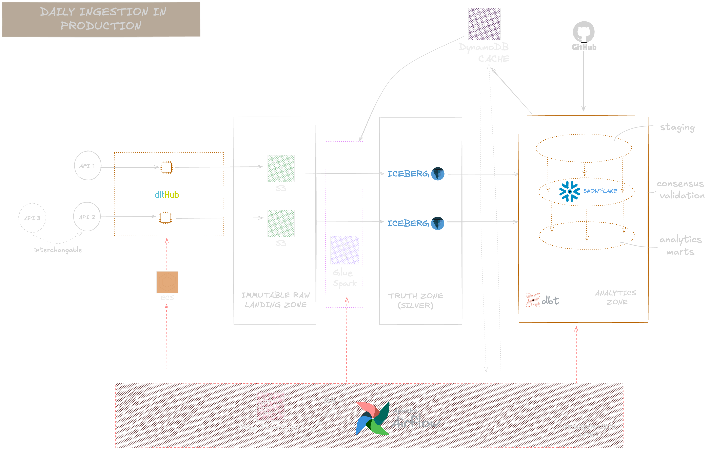
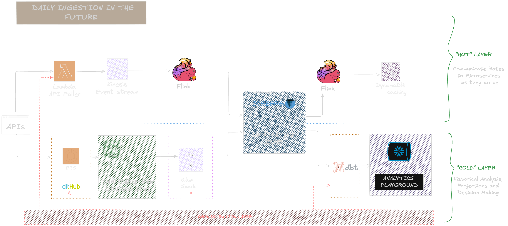

# MakeRates - FX Currency Intelligence Service 


  A versatile and scalable way to integrate currency exchange rates from trusted API's : 
   **Make** currency analytics easy!
---
A POC case study for Make.com

<div align="center">
  
  
  
  
  
  
  
  
  
  
  

</div>


### Prerequisites
- 💻 **OS**: macOS or Linux (cross-platform compatible)
- 🐋 **Docker / Docker Desktop**
- 🤖 **just** the *Rust* based command runner that overthrows complex Makefiles 
([Just start using it!](https://berkkaraal.com/blog/2024/12/06/just-start-using-it/)📖)
- 🧠 **Minimum: 8GB RAM** (allocating 6GB+ to Docker) / **Recommended: 16GB+ RAM**


### Technologies Included Out-Of-The-Box
***You don't have to worry about them :  the infrastructure is already packaged for you***

| Component | Technology | Description | Version |
| :--- | :--- | :--- | :--- |
| **Orchestration** | [Kestra](https://kestra.io) | Declarative Workflow orchestration & scheduling | `latest` |
| **Object Storage** | [MinIO](https://min.io) | S3-compatible object storage | `latest` |
| **Compute & Analytics storage** | [DuckDB](https://duckdb.org) | Analytical OLAP database with single-node processing | `>=1.0.0` |
| **Transformation** | [dbt](https://www.getdbt.com) | SQL-based transformations for Consensus Checks and Analytics tables | `1.8` (dbt-duckdb 1.10.0) |
| **Iceberg processing** | [PyIceberg](https://py.iceberg.apache.org/) | Python processing library for Apache Iceberg (Open table format) | `>=0.6.0` |
| **Cache & state management** | [DynamoDB Local](https://aws.amazon.com/dynamodb/) | AWS NoSQL database with lightning fast access | `latest` |
| **Catalog** | [PostgreSQL](https://www.postgresql.org) | Metadata catalog for Kestra & Iceberg | `15-alpine` |
| **Language** | [Python](https://www.python.org) | Core extraction & loading logic  | `>=3.12` |


## 🚀 Quick Start (2 Minutes)

### 💡 Preliminaries
- **API Keys**: Acquire API keys for free-tier accounts from **BOTH** commercial providers (ExchangeRate-API, CurrencyLayer - Frankfurter is free) 

  Follow the instructions : 📃[**API Keys Guide**](get-api-keys.md)
- **Ensure JUST is installed**: ```$ brew install just```🍎  or ```$ sudo apt install just```🐧

  ```bash
  just --version
  ```
- 🔑 Provide **environement variables** under `.env` : For this POC you just need to fill out the following: 
```
EXCHANGERATE_API_KEY=<YOUR-API-KEY>
CURRENCYLAYER_API_KEY<YOUR-API-KEY>
```
> Do **not** alter the rest of the variables under this file!

That's it! ✅


### Setup & Run
#### 1. Spin-up local infrastructure and initialize  services (Wait...)👀
```bash
just init
```
#### 2. Select-Menu appears : choose [1-7] or Esc and run pipeline manually
```bash
╔═════════════════════════╗
║  Makerates POC - Menu   ║
╠═════════════════════════╣
║ 1) Run Daily Pipe       ║
║ 2) Run a Backfill       ║
║ 3) Inspect MinIO S3     ║
║ 4) Inspect DynamoDB     ║
║ 5) Peek at output data  ║
║ 6) Stop Makerates       ║
║ 7) Reboot Makerates     ║
║ 8) Exit Menu            ║
╚═════════════════════════╝
```
Choose 1 to Access Daily Pipeline topology view in Kestra UI , or 2 for Backfill flow.

#### 3. Run the Pipeline(s)
* Hit `Execute` button in UI to run the Daily flow.
> To add **CurrencyLayer** as a source click on `TRUE` within the dialog box.


* For the Backfill flow, simply select `start_date` and `end_date` for desired historical date range. Hit `Execute`.


#### 4. Continue with more actions via Menu (ENTER and next choice selection)
If you accidentaly escape the menu you can run:
```
just menu
```

#### 5. Alternatively continue manually using `just` recipes:
Eg. Inspect Minio S3 buckets after running the pipeline
```
just open-minio
```
Find more available commands in [🛠 Useful Commands (Justfile)](#just-commands)


#### 6. If you have `duckdb` installed locally on your machine (not required) you can analyze end data:
```bash
duckdb -ui data/analytics.duckdb
```
Otherwise you can preview some samples using `just`:
```bash
just duck-it
```
(Equivalent of option 5)


#### 7. Force-stop services : (Option 6 on Menu)


---

## 🏗 ELT Architecture

> [!IMPORTANT]  
> External API’s are not forgiving : we shall not pay the price of our outages.We shift “Loading” to the left, with an ELT approach 

> [!NOTE]  
> This pattern permits us to maintain a raw immutable store of **“facts”**, towards a full audit trail.



### ELT Data Flow 
A. **Extraction** with `dlt-hub`: 
 1. Automatic schema discovery from API responses

 2. Flattening nested JSON structures

 3. Stateful & Structured data loading to our Lake (s3/minIO) - **OUR IMMUTABLE STORE**

B. **Loading** at `Iceberg` targets: 
  1. Raw JSONL’s sent compressed in our Lake (s3/minIO)
  2. Containerized app parses the jsonl files, filters duplicates, reconstructs FX rates nested map structure, compacts files to `AVRO` and sends **latest** rows to Iceberg tables.


C. **Validation & Transformation** with `dbt`: 
  1. Consensus cross-validation and flagging of outliers
  2. Currency conversion-ready schemas 
  3. Final analytics aggregation stats and health checks 

D. **Sync**: Upsert validated rates to **DynamoDB** (Hot Tier) - Ready to plug data stream in the future!

**Consensus Strategy**:
- **Validation Checks**: Flags deviation > 0.5% between sources.
- **Failover**: API's are throttled before hitting quotas and soures are merged at `dbt` models. Prioritization is configurable in two stages : 
    1. extraction Kestra flow
    2. dbt models



---
### Makerates in Production (the Next Step)



---

### Makerates Multi-scoped Optimization (the Very Next Step)



---
## 🪙 Currency API Comparison


| Provider | Strengths | Pricing | Update Frequency | Suitable Use Cases |
|--------|-----------|---------|-----------------|------------------|
| **ExchangeRate-API** | Aggregation from **30+ sources**, **160+ currencies**, historical data **1990–2020 for ~35 currencies** and **full coverage from 2020 onwards**, powerful free tier available | Freemium model: **1,500 free requests/month** · **$10/month for 30k requests** (hourly updates) | Close to real-time updates with **minute-level granularity** on business plans | Analytics and operational use cases |
| **Frankfurter.dev** | **European Central Bank official data**, open-source API wrapper, **31+ currencies**, **20+ years of historical data**, perfect for **POC experimentation** | Free for life, **no auth, no rate limits** | **Daily at 16:00 CET**, strictly aligned with ECB publication schedule | Analytics and non-real-time use cases |
| **CurrencyLayer** | **Enterprise reliability**, bank-level accuracy, **20+ years of historical data**, **168 currencies**, REST API | Premium pricing: **100 free requests** for testing · **$8.99/month for 2,500 requests** (hourly updates) | Close to real-time updates with **minute-level granularity** on enterprise plans | Analytics and operational use cases |

---

## 🛠 Useful Commands (Justfile)

| Command | Description |
| :--- | :--- |
| **Core Connection** | |
| `just init` | **Start Here**: Initialize full stack & open interactive menu |
| `just run` | Spin up infrastructure (Docker + DynamoDB init) |
| `just stop-makerates` | Stop all running containers |
| `just reset` | **Hard Reset**: Wipe data, volumes & restart fresh |
| **Interfaces** | |
| `just menu` | Open the CLI interactive menu |
| `just open-daily-topology` | Open *Daily Rates* flow in Kestra UI |
| `just open-backfill-topology` | Open *Backfill* flow in Kestra UI |
| `just open-minio` | Open MinIO Console (S3 Browser) |
| `just open-dynamo` | Open DynamoDB Admin UI |
| **Data Inspection** | |
| `just duck-it` | Run SQL queries on Gold/Silver data (DuckDB) |
| **Maintenance** | |
| `just logs` | Tail Kestra server logs |
| `just restart-kestra` | Fast restart of Kestra service only |
| `just clean-iceberg` | Fix/Wipe Iceberg catalog state |

---


<!-- > [!TIP]
> 


> [!WARNING]  
> Critical content demanding immediate user attention due to potential risks.

> [!CAUTION]
> Negative potential consequences of an action. -->