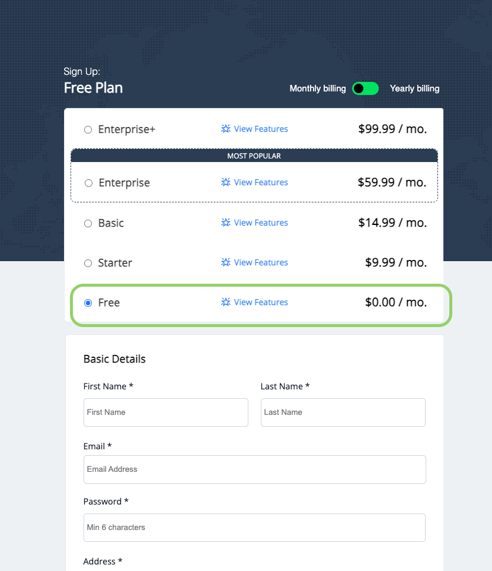
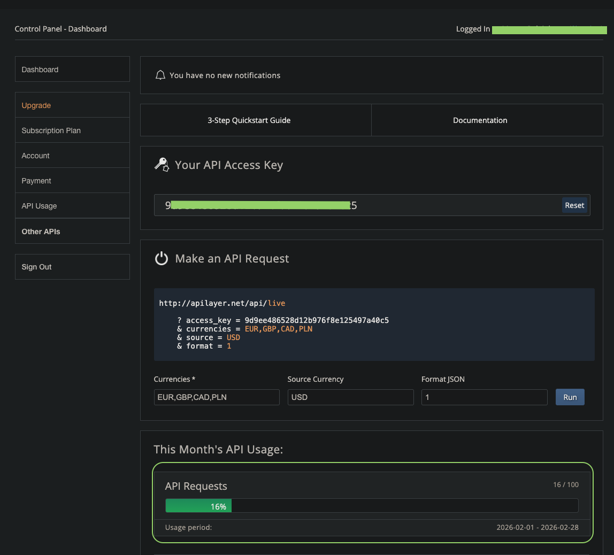
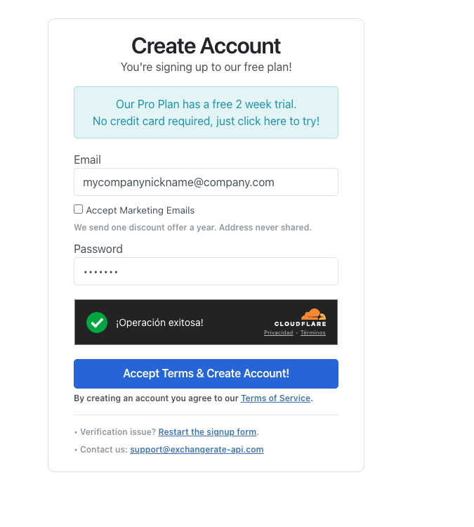
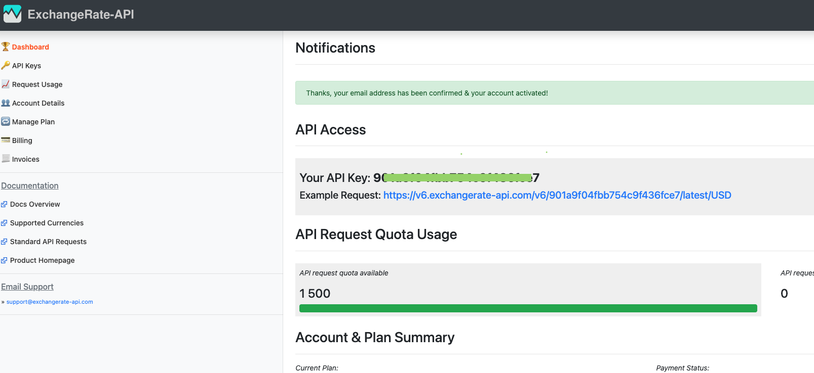

# 🌐 API Keys Acquisition Guide

**Target Services:** Currencylayer & ExchangeRate-API

---

## 1. 📗 Currencylayer API

*Reliable, enterprise-grade data with a generous free entry point.*

1. **Navigate:** Visit [currencylayer.com](https://currencylayer.com/signup/free).
2. **Account Creation:** Ensure the **Free Plan** is selected and proceed with you personal infromation.
 

* Enter your username, email, and password.
* **Crucial:** You must verify your email address via the link sent to your inbox.

4. **Retrieve Key:** * Log into your [Dashboard](https://currencylayer.com/dashboard).
   
   * Locate the box labeled **"Your API Access Key"**.
   * Copy the alphanumeric string provided.
   

> **Note:** Free Tier Limit is 100 requests per month. The base currency is locked to **USD**.

---

## 2. 📕 ExchangeRate-API

*High-volume free tier, ideal for hobbyist developers and small apps.*

1. **Navigate:** Visit [exchangerate-api.com](https://www.exchangerate-api.com/).
2. **Initiate:** Click the large **"Get Free Key"** button on the hero section.
 
3. **Register:** * Provide your email address.
   * Check your inbox for the "Confirmation Email."
4. **Setup:** Click the link in the email to set your password and activate your account.
5. **Retrieve Key:**
   * You will be redirected to your dashboard immediately.
   * Your key is displayed prominently under **"API Access"**-->**"Your API Key"**.
   

> **Note:** Free Tier Limit is 1,500 requests per month. Supports **multiple base currencies**.

---

## 📊 Comparison Summary for Free Tier

| Feature | Currencylayer | ExchangeRate-API |
| :--- | :--- | :--- |
| **Free Requests** | 100 / mo | 1,500 / mo |
| **Best Feature** | Accuracy & Reliability | High Request Volume |
| **Default Base** | USD base only (in Free tier) | Flexible |
| **Free Tier Data Refresh** | 24 Hours | 24 Hours |

---

## 🛠 Quick GET Snippets

### Currencylayer (REST)

`http://api.currencylayer.com/live?access_key=YOUR_KEY`

### ExchangeRate-API (REST)

`https://v6.exchangerate-api.com/v6/YOUR_KEY/latest/USD`

